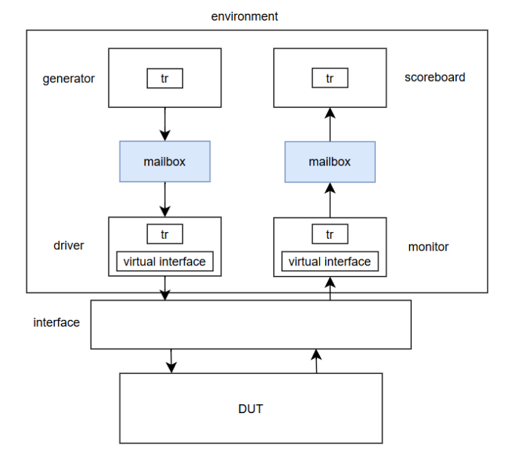
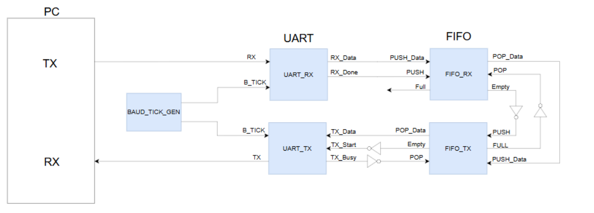
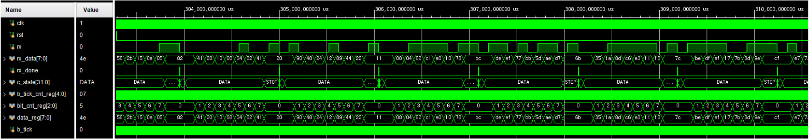
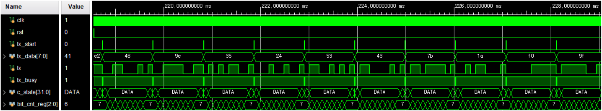
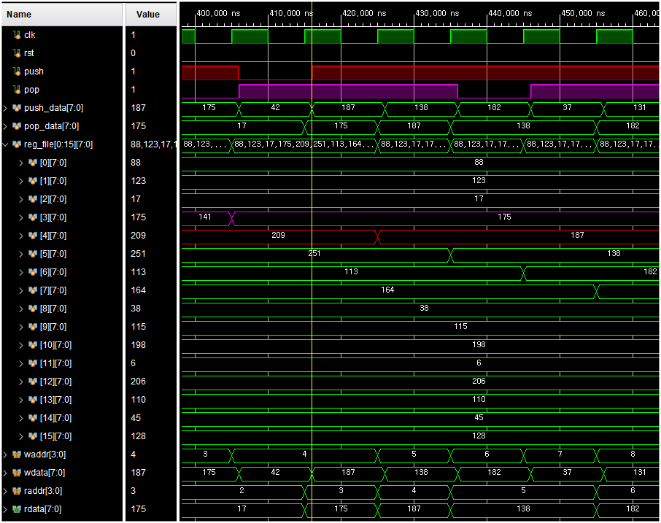
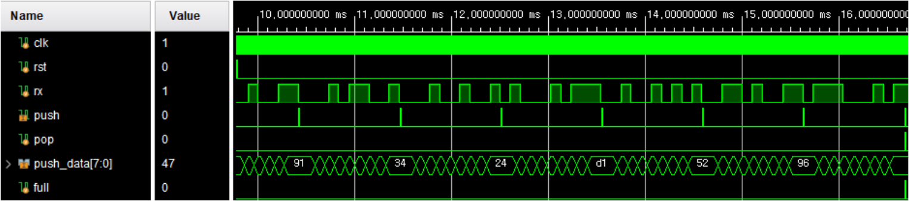
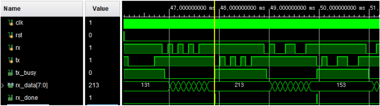
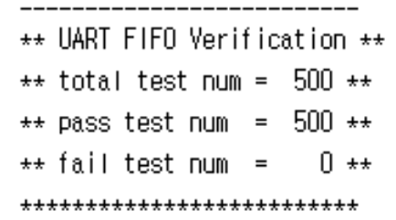
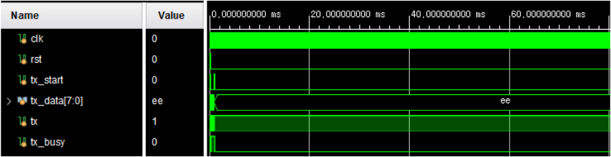
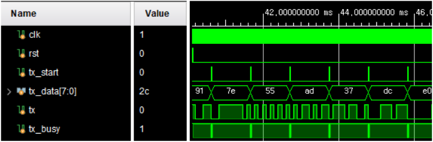

# UART + FIFO SystemVerilog Verification

UART TX/RX와 FIFO RTL을 대상으로 SystemVerilog 클래스 기반 자동화 검증 환경을 구현한 프로젝트입니다. 각 모듈을 개별 검증한 뒤 UART RX → FIFO → UART TX로 이어지는 Loopback 구조까지 확장하여 데이터 정합성과 전송 순서를 확인했습니다.

- 개발 기간: 2026.05.12 ~ 2026.05.18
- 설계·검증 언어: Verilog HDL, SystemVerilog
- 개발 환경: Xilinx Vivado 2020.2, Vivado Simulator
- UART 설정: 9600 bps, 8-N-1, LSB First, 16x Oversampling
- FIFO 구성: 8-bit Data, Depth 16

## 검증 환경

Transaction에서 생성한 데이터를 Generator가 Driver와 Scoreboard에 전달하고, Driver는 Virtual Interface를 통해 DUT 입력을 구동합니다. Monitor가 DUT 출력을 수집하면 Scoreboard가 기대값과 실제값을 비교해 PASS/FAIL을 집계합니다.

  

- Generator: 제약 조건을 적용한 랜덤 Transaction 생성
- Driver: UART Frame 또는 FIFO Push/Pop 신호 구동
- Monitor: DUT 출력과 완료 신호 수집
- Scoreboard: Expected Data와 Actual Data의 1:1 비교
- Mailbox: 컴포넌트 사이의 Transaction 전달
- Event: 다음 Transaction의 생성·처리 시점 동기화

## 전체 구조

UART RX에서 수신한 데이터는 FIFO에 저장되고, FIFO에서 출력된 데이터는 UART TX를 통해 다시 직렬 송신됩니다. 단위 모듈 검증 이후 동일한 데이터 경로를 기준으로 통합 검증을 진행했습니다.

  

## 검증 내용

### UART RX

- Reset 이후 RX Idle 상태와 초기값 확인
- Start Bit, 8-bit Data, Stop Bit로 구성된 UART Frame 입력
- rx_done 발생 시점에 수신 데이터를 수집하여 기대값과 비교
- 랜덤 데이터 500개 검증: 500 PASS / 0 FAIL

  

### UART TX

- Reset 이후 TX Idle 상태와 tx_busy 초기값 확인
- 병렬 입력 데이터를 UART 직렬 신호로 변환하는 과정 검증
- Monitor에서 Start Bit와 Data Bit를 복원하고 Baud Period 확인
- 랜덤 데이터 500개 검증: 500 PASS / 0 FAIL

  

### FIFO

- Reset 이후 empty=1, full=0 확인
- Push 16회 수행 후 full 신호 확인
- Pop 16회 수행 후 empty 신호 확인
- Push/Pop 조합을 랜덤하게 생성하여 데이터 순서와 무결성 검증
- 총 500개 Transaction 중 실제 Pop이 발생한 344건 비교: 344 PASS / 0 FAIL

  

### UART RX + FIFO RX

- UART RX로 랜덤 데이터 16개 전송 후 FIFO full 확인
- Pop 16회 수행 후 입력 데이터와 출력 데이터 비교
- 검증 결과: 16 PASS / 0 FAIL

  

### UART + FIFO Loopback

- UART RX → FIFO RX → FIFO TX → UART TX 전체 경로 검증
- 랜덤 데이터 500개 검증: 500 PASS / 0 FAIL
- 1부터 16까지 순차 데이터를 전송하여 FIFO 순서 보존 확인
- 0xFF, 0x55, 0xAA, 0x00 경계값 데이터 검증

  

  

## 문제 해결

UART TX 검증에서 첫 번째 데이터는 정상 송신됐지만 두 번째 데이터부터 Monitor가 응답을 기다리며 시뮬레이션이 멈추는 문제가 있었습니다.

- 원인: tx_busy가 1인 상태에서 다음 tx_start가 입력되어 DUT가 요청을 무시함
- 수정: Driver가 tx_busy 해제를 확인한 뒤 다음 Transaction을 구동하도록 변경
- 타이밍 보완: posedge clk 이후 1 ns가 지난 시점에 입력을 인가하여 DUT와 Testbench 사이의 Race Condition 방지
- 결과: 모든 Transaction이 순차적으로 처리되며 Monitor와 Scoreboard가 정상 종료됨

  
  

## 파일 구성

- **src/uart**: UART RX/TX RTL과 개별 Testbench
- **src/fifo**: FIFO RTL과 Push/Pop Testbench
- **src/uart_rx_fifo**: UART RX와 FIFO RX 통합 RTL 및 Testbench
- **src/uart_fifo_loopback**: UART RX → FIFO → UART TX Loopback RTL 및 Testbench
- **assets**: 검증 구조도, 시뮬레이션 파형, Scoreboard 결과
- **docs**: 완료보고서, 발표자료, 일정표, 날짜별 개발일지

## 실행 방법

1. Vivado 2020.2에서 RTL Project를 생성합니다.
2. 검증할 항목의 **rtl** 폴더와 **tb** 폴더에 있는 SystemVerilog 파일을 추가합니다.
3. 아래 Testbench 모듈 중 하나를 Simulation Top으로 설정합니다.
   - UART RX: **tb_uart_rx**
   - UART TX: **tb_uart_tx_sv**
   - FIFO: **tb_fifo_sv**
   - UART RX + FIFO RX: **tb_uartrx_fiforx_sv**
   - UART + FIFO Loopback: **tb_uart_fifo_sv**
4. Run Behavioral Simulation을 실행해 파형과 콘솔의 PASS/FAIL 결과를 확인합니다.

각 검증 폴더에는 독립 실행에 필요한 RTL이 함께 포함되어 있습니다. 동일한 이름의 모듈이 있으므로 여러 검증 폴더의 파일을 한 프로젝트에 동시에 추가하지 않고 항목별로 실행하는 방식이 적합합니다.
